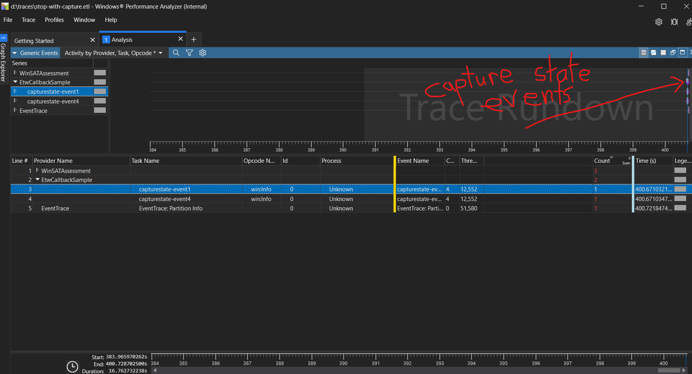

# Testing Mutli-session ETW Tracing
This repo contains a Visual Studio solution to build a console app: `EtwCallbackSample.exe`.  The app registers a provider (Provider GUID: `{0205c222-cf97-5c11-9756-56a2cee02cb0}`) using the [`TraceLoggingRegisterEx`](https://learn.microsoft.com/en-us/windows/win32/api/traceloggingprovider/nf-traceloggingprovider-traceloggingregisterex) function.  

The callback function supplied to the `TraceLoggingRegisterEx` function logs the parameters it receives whenever it is called.  I'm using this app to understand the protocol between [Event Tracing for Windows](https://learn.microsoft.com/en-us/windows-hardware/drivers/devtest/event-tracing-for-windows--etw-) and an app when multiple trace sessions are active and the provider implemented by the app needs to emit state during capture state callbacks.

To conduct experiments I'll use Windows Performance Recorder (`wpr.exe`) to control my trace sessions.  `wpr.exe` ships with Windows in the system32 directory.  It can be used to start and stop multiple simulataneous tracing sessions with commands like the following:

```
wpr -start sample.wprp -instancename session1
```

## Experiment 1

1. Start `EtwCallbackSample.exe`
2. Run (all Run commands need to take place in an administrative command prompt) `wpr.exe -start sample.wprp -instancename session1`
3. Run `wpr.exe -start sample2.wprp -instancename session2`
4. Run `wpr.exe -stop c:\traces\session1.etl -instancename session1`
5. Run `wpr.exe -stop c:\traces\session2.etl -instancename session2`
6. Type 'q' to quit `EtwCallbackSample.exe`

The output of `EtwCallbackSample.exe` when running step 1:


```
Calling TraceLoggingRegisterEx.
TraceLoggingRegisterEx returned.

Type 'q' when you want to quit.
```

When running step 2:
```
is_enabled:0000000000000001; level:0000000000000005; match_any_keyword:0000000000000003; match_all_keyword:0000000000000000; filter_data:0000000000000000
is_enabled:0000000000000002; level:0000000000000005; match_any_keyword:0000000000000003; match_all_keyword:0000000000000000; filter_data:0000000000000000
is_enabled:0000000000000001; level:0000000000000005; match_any_keyword:0000000000000001; match_all_keyword:0000000000000000; filter_data:0000000000000000
```

When running step 3:
```
is_enabled:0000000000000001; level:0000000000000007; match_any_keyword:0000000000000019; match_all_keyword:0000000000000000; filter_data:0000000000000000
is_enabled:0000000000000002; level:0000000000000007; match_any_keyword:0000000000000018; match_all_keyword:0000000000000000; filter_data:0000000000000000
is_enabled:0000000000000001; level:0000000000000007; match_any_keyword:0000000000000009; match_all_keyword:0000000000000000; filter_data:0000000000000000
```

When running step 4:
```
is_enabled:0000000000000001; level:0000000000000007; match_any_keyword:000000000000000D; match_all_keyword:0000000000000000; filter_data:0000000000000000
is_enabled:0000000000000002; level:0000000000000005; match_any_keyword:0000000000000005; match_all_keyword:0000000000000000; filter_data:0000000000000000
is_enabled:0000000000000001; level:0000000000000007; match_any_keyword:0000000000000009; match_all_keyword:0000000000000000; filter_data:0000000000000000
is_enabled:0000000000000001; level:0000000000000007; match_any_keyword:0000000000000008; match_all_keyword:0000000000000000; filter_data:0000000000000000
```

When running step 5:
```
is_enabled:0000000000000001; level:0000000000000007; match_any_keyword:0000000000000028; match_all_keyword:0000000000000000; filter_data:0000000000000000
is_enabled:0000000000000002; level:0000000000000007; match_any_keyword:0000000000000028; match_all_keyword:0000000000000000; filter_data:0000000000000000
is_enabled:0000000000000001; level:0000000000000007; match_any_keyword:0000000000000008; match_all_keyword:0000000000000000; filter_data:0000000000000000
is_enabled:0000000000000000; level:0000000000000000; match_any_keyword:0000000000000000; match_all_keyword:0000000000000000; filter_data:0000000000000000
```

When running step 6:
```
Calling TraceLoggingUnregister.
TraceLoggingUnregister returned.
```

My conclusions after reasoning about this output are as follows:
1. The keywords of multiple tracing sessions are OR'd together during `is_enabled == 1` callbacks.  The provider should emit events matching the last `is_enabled == 1` callback whenever that event occurs.  It should continue emitting these events as appropriate until it is instructed to emit another set given by a later `is_enabled == 1` callback, or until tracing is disabled with `is_enabled == 0`.  Notably, `is_enabled == 2` callbacks should not affect the set of events that are being emitted, or other tracing sessions will be deprived of the events they've requested.
2. `is_enabled == 2` instructs the provider to emit metadata needed for the set of events that match the keywords provided.  I strongly suspect that when an `is_enabled == 2` callback occurs due to a CaptureOnSave directive, that the provider should explicitly block the callback thread while state is being emitted if asynchronous activity is necessary to emit the requested state; otherwise the tracing session may end prior to capturing the requested state.

To confirm my suspicion on the second point, I conducted another experiement.

## Experiment 2
I added code to start a new thread which will run a function that emits capture state events after waiting 10s.  In the first test I joined the thread to the ETW callback thread to wait for the events to emit.  In the second test I did not join the thread.

The first test successfully captured the events associated with the capture state callback.  The events appear in WPA approximately 10s into the trace rundown time.



The second test did not capture any events.

I conclude from this experiment that the ETW callback thread must wait to block the session from stopping prematurely when async activity is necessary to produce capture state events.